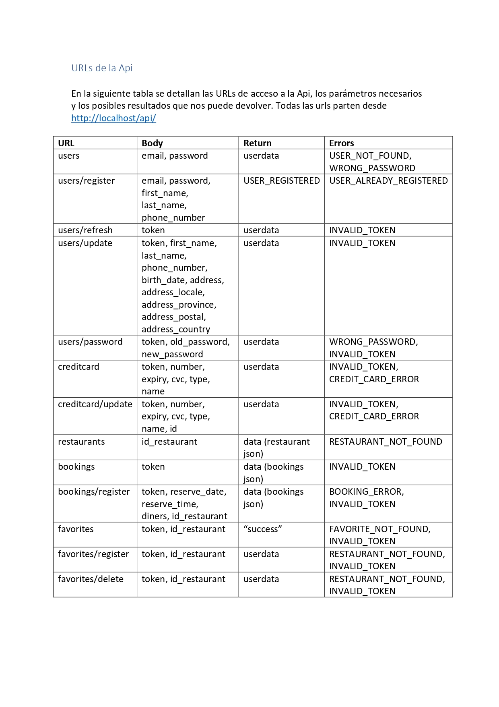

# Yay! RESTful API

---

Yay Api, código fuente del servidor que proporciona la Api para la APP Yay!

Un servidor RESTful implementado con CodeIgniter usuando una librería, un fichero de configuración y un controlador

---

## URLs accesibles
